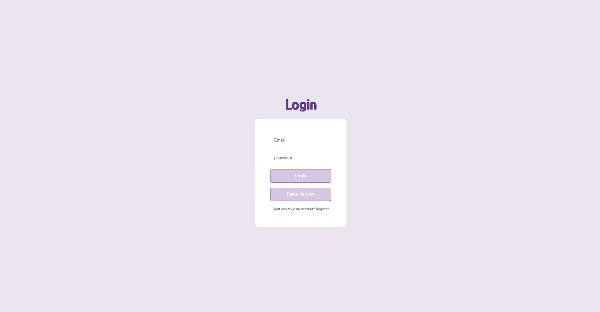
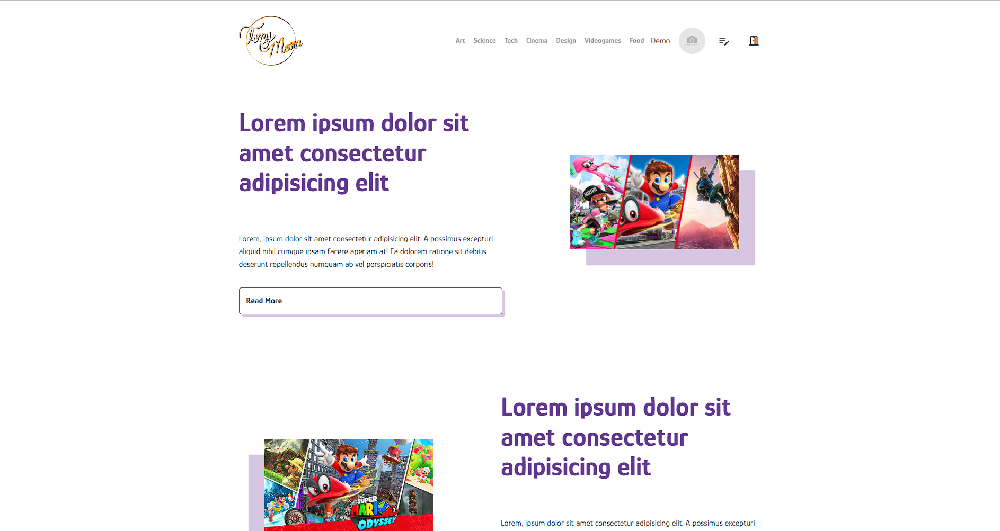
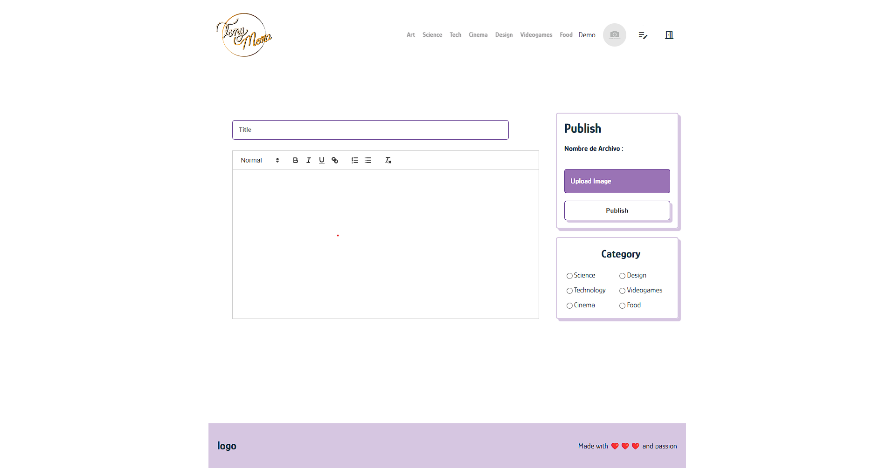

# Your Space
Pequeño repositorio con el código necesario para el desarrollo de un sitio web orientado a la creación y distribuión de contenido de temas varíos.

## ¿Cómo funciona?
La aplicación cuenta con dos modos, en caso de que el servidor no se encuentre arriba al momento de querer visualizar el sitio se puede acceder a la versión de Demo, que permite interactuar con la mayoría de la interfaz gráfica, pero no permite la creación de contenido.

